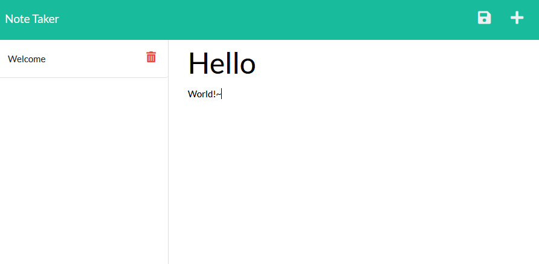

# Note Taker

  ## Description
  
A simple app to save notes for later use. Saves information to a server to avoid issues with localstorage.
  
  ## Table of Contents
  
  - [Installation](#installation)
  - [Usage](#usage)
  - [License](#license)
  - [Contributing](#contributing)
  - [Tests](#tests)
  - [Questions](#questions)
  
  
  
  ## Installation
  
 Access it from this [heroku link](https://git.heroku.com/salty-badlands-08193.git). Clone it from the [github repository](https://github.com/T0mWhite/Note-Taker) and run it locally using node.js.
  
  ## Usage
  
Click the '+' button to add a new note, and the 💾save💾 button to save the note. Click the 🗑garbage🗑 button to delete the note.

[Youtube Video of Application in Action](https://youtu.be/L1EJCYBBJR0)

  ## License
© Tommy White, 2021

[Coffeeware](https://github.com/Sonic853/coffeeware-license)
     License

        
  
  ## Contributing
  
Reach out to me.
  
  ## Questions
  
Email me.
  
  #### Github
  
  https://github.com/T0mWhite
  
  #### Email
  
tbw2.mail@gmail.com
  
  
  

